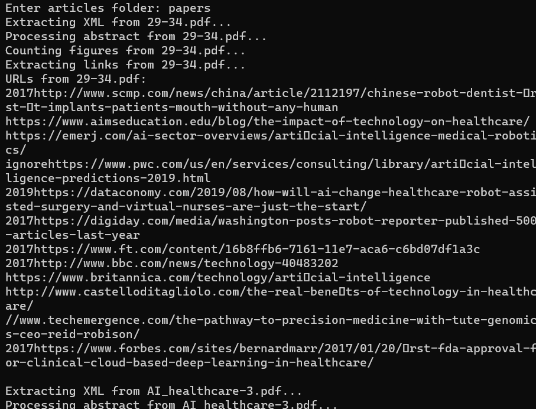
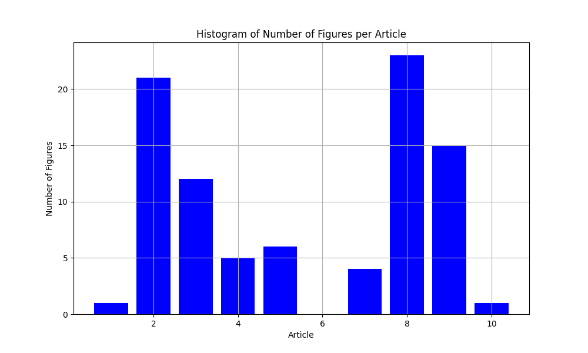

[](https://doi.org/10.5281/zenodo.10657570) [](https://text-analysis.readthedocs.io/en/latest/?badge=latest)

# AI-And-Open-Science-In-Research-SW-Engineering
Repository for Artificial Intelligence and Open Science In Research Software Engineering deliverables

## Description
This project uses **Grobid**, a machine learning software, to extract structured metadata and content from documents in PDF format. The extracted information includes a word cloud with the keywords of the abstracts of the all documents, a bar chart showing the number of figures and the URLs that appear in each PDF document.

## Requirements
To run this program you will need:
* [Docker](https://docs.docker.com/engine/install/) which is a software that provides a convenient way to package, distribute and run applications as containers, ensuring consistency across different environments.
* [Grobid](https://github.com/kermitt2/grobid) which is a machine learning-based toolkit for extracting information from documents in PDF format. To run Grobid using Docker, you can use the official Docker image available on **Docker Hub**:
  ```
  docker pull lfoppiano/grobid:0.7.2
  ```

## Installation instructions
1. Clone the repository from GitHub to your local machine:
    ```
    git clone https://github.com/yiminzhou7/Text-Analysis.git
    ```
2. Start the docker server
3. Install Grobid
    ```
    docker pull lfoppiano/grobid:0.7.2
    ```


## Execution instructions
1. Run the Docker server.
2. Run Grobid on **localhost:8070**:
    ```
    docker run -t --rm -p 8070:8070 lfoppiano/grobid:0.7.2
    ```
    You can check if Grobid is running properly by openning a web browser and visit the following URL: [http://localhost:8070](http://localhost:8070).
3. Create a virtual environment with [conda](https://docs.conda.io/projects/conda/en/latest/user-guide/install/index.html): 

    Create a blanck virtual environment with a name in python 3.10
   
    ```
    conda create -n text_analysis python=3.10
    ```

    Activate the environment.

    ```
    conda activate text_analysis
    ```
    
    Install the dependencies from `requirements.txt` file:
   
    ```
    pip -r install requirements.txt
    ```
    
5. Before running the main program, it is recommended to run the `testing.py` file found in the "**tests**" folder. For this purpose, go to the main directory ("Text-Analysis") and execute

    ```
    python tests.testing.py
    ```
    
6. After passing the tests, stay in the main directory and execute the **main** program

    ```
    python main.py
    ```

    Once executed, the program will show on screen all the links it has found from the different papers. Additionally, it will create a wordcloud based on the abstracts and a histogram of number of figures per paper and save them in the "**results**" folder.


## Running examples
The main program has been run with 10 PDFs (stored in the **papers** folder). A screenshot of the terminal is shown below. The terminal shows the URLs found in each paper.
<figure>
  
  <figcaption><i>Figure 1. URLs from each paper.</i></figcaption>
</figure>


The wordcloud results of the abstracts and histogram of number of figures are shown below.
<figure>
  
  <figcaption><i>Figure 2. Wordcloud generated from the abstracts text.</i></figcaption>
</figure>


<figure>
  
  <figcaption><i>Figure 3. Histogram of number of figures per paper.</i></figcaption>
</figure>


## Preferred citation
Yimin Zhou.

## Where to get help
You can write to yimin.zhou@alumnos.upm.es about any help you may need.
